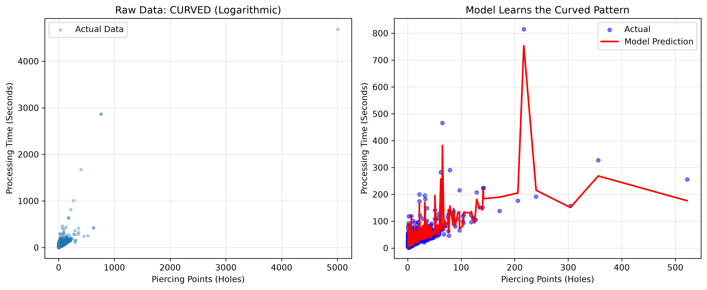

# 🎯 Precision Manufacturing Time Prediction 

## 📌 Project Overview
This project solves a highly technical real-world manufacturing challenge: **Predicting processing and cut times for high-precision semiconductor/chip manufacturing equipment.** 

Traditionally, estimating part processing times relies heavily on the manual judgment of experienced engineers, which can be slow and inconsistent. This project leverages **Machine Learning (Gradient Boosting)** to automate and accurately predict processing times based on part geometry, material properties, and operational parameters, achieving a **Test R² of 93.7%**.

This project successfully transitioned from a pure research exercise into a robust, data-driven proof-of-concept for automated production planning.

---

## 🚀 Business Impact & Value
- **Consistency**: Eliminates human bias and variance in estimating production times.
- **Speed**: Automates the time-estimation pipeline, which can directly accelerate quoting, scheduling, and sales processes.
- **Data-Driven Precision**: Moves away from pure "gut feeling" to analytical predictions based on 33 geometric and programmatic features.

---

## 🧠 Technical Approach & Architecture

### 1. Data Pipeline
- Built a custom **XML deep scanner** to parse thousands of production XML logs.
- Extracted **33 critical features**, normalized all units, and aggregated them into a clean dataset of **7,144 records**.

### 2. Feature Engineering
Features fall into four main categories:
1. **Geometry**: Length, Width, Thickness, Area, Weight, Perimeter.
2. **Processing Work (Strongest Predictors)**: Actual operational travel paths (`CuttingLengthPart_mm`), number of precision points/drills (`Piercing_Points`).
3. **Hardware Setup**: Substrate/Material group, raw thickness, assist gas type, optical settings (`LensFocalLength_mm`).
4. **Context**: Quantities, production runs, layout efficiency, area on sheet.

### 3. Model Evolution & Insights
- **Attempt 1: Linear Regression**
  - **Result**: Failed (Test R²: 0.71).
  - **Insight**: Discovered the relationship between precision points and processing time is *logarithmic*, not linear. Adding operational points from 1 to 10 significantly increases time, while going from 100 to 110 points adds very little. A linear line couldn't capture this.
- **Attempt 2: Gradient Boosting Regressor (Final Model)**
  - **Result**: Success! The tree-based model naturally handled the non-linear curvature of the data.

### 📊 Performance Metrics (Gradient Boosting)
| Metric | Training Data | Testing Data (Unseen) |
| :--- | :--- | :--- |
| **R² Score** | 0.9934 (99.34%) | **0.9372 (93.72%)** |
| **MAE** | 4.24 seconds | **4.73 seconds** |
| **MAPE** | 19.68% | **20.28%** |

*Note: Overfitting was tightly controlled, with the Train-Test R² gap dropping from 17.9% (Linear) to just 5.6% (Gradient Boosting).*

---

## 📈 Visualizing the Curve (Linear vs Logarithmic)

*The plot on the left shows the raw logarithmic distribution. The plot on the right demonstrates how the Gradient Boosting model accurately maps to the real-world curved distribution, unlike a linear model.*

---

## ⚙️ Physics Baseline vs. Machine Learning
Why use ML instead of a hardcoded physics formula? 
A basic formula handles the linear baseline: `processing_time ≈ (Travel Path / speed) + (Points × time_per_point)`.
**However, the ML model successfully captures the hidden "overhead"**: precise positioning moves, table switches, acceleration/deceleration, and layout nuances—factors that are nearly impossible to compute manually but greatly impact cycle times.

---

## 🔮 Future Roadmap (Phase 2 & 3)
- **Geometry from Raw CAD (STP)**: Extracting feature data directly from raw engineering files using advanced feature engineering (contour detection).
- **Deployment**: Building a "Drop-a-file" pipeline to output predictions directly to Excel for non-technical users.
- **Generalization**: Scaling the pipeline to other machine types and power classes.

---

## 🛠️ Tech Stack
- **Languages**: Python
- **Libraries**: `pandas`, `scikit-learn` (Gradient Boosting, train_test_split, metrics), `matplotlib`, `numpy`
- **Algorithms**: Gradient Boosting Regressor, Linear Regression
- **Data Engineering**: XML Parsing, Data Normalization, Feature Extraction
